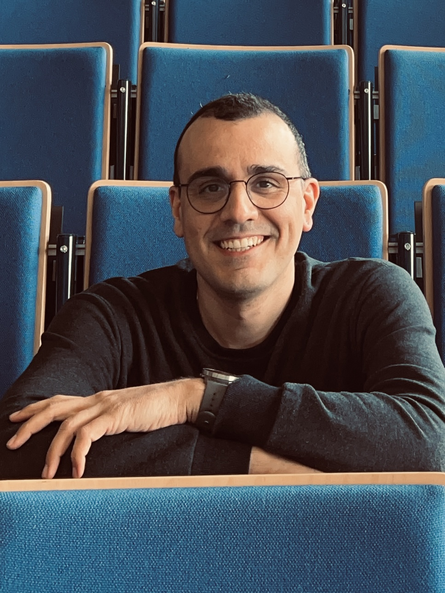

<main id="main" class="wrap">
  <section id="about">
    

      

        
        

          
          
          
        

      

      

        

         Hi, I’m Mahdi - a PhD researcher at the Centre for mathematical Plasma Astrophysics (CmPA), KU Leuven. I'm part of an international research team   led by Prof. Dr. Stefaan Poedts, dedicated to developing realistic computational models of the solar atmosphere. My research specifically targets the lower solar atmosphere, where I am working to create a multi-fluid model of the solar chromosphere.
        

        

          Solar plasma
          MHD
          Numerical modelling
        

        
      

    

  </section>

  

  

</main>
